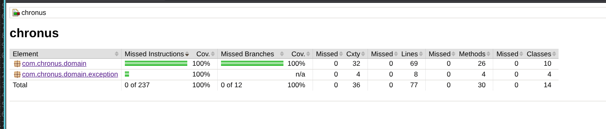
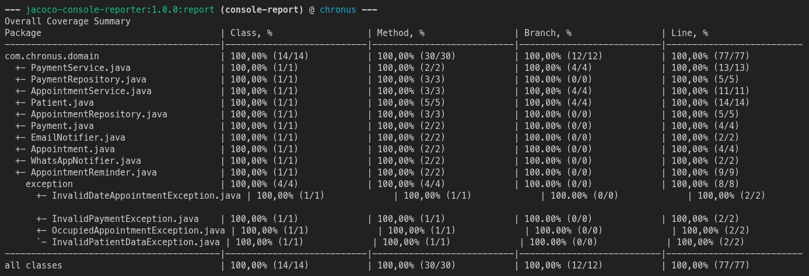

# Chronus — Sistema de Gestión de Citas Médicas

**Chronus** es el **Hito 1** del Curso de Java de [Desafío Latam](https://desafiolatam.com/) y [Globant](https://www.globant.com/).

El proyecto implementa el núcleo de dominio de una aplicación de agendamiento para profesionales de la salud. Gestiona citas, datos de pacientes, pagos y recordatorios, sin depender de bases de datos, frameworks web ni servicios externos reales.

---

## Propósito y visión del negocio

En un centro de salud, coordinar horarios, mantener los datos de contacto de los pacientes y confirmar pagos requiere reglas claras para evitar errores de agenda y comunicaciones incompletas.

**Chronus** centraliza esas reglas en clases Java puras. El sistema valida que las citas sean futuras y no colisionen, exige información de contacto para cada paciente, acepta únicamente pagos enteros positivos y prepara recordatorios por email y WhatsApp.

---

## Reglas de negocio

El núcleo de la aplicación se orquesta desde `CreateAppointmentService`, `AcceptPaymentService` y `SendAppointmentReminderService`.

1. **Fecha de cita válida:** una cita debe estar estrictamente en el futuro. Una fecha pasada o igual al momento actual genera `InvalidDateAppointmentException`.
2. **Sin colisiones:** no se pueden registrar dos citas en la misma fecha y hora. La segunda solicitud genera `OccupiedAppointmentException`.
3. **Datos del paciente:** el nombre completo y el teléfono son obligatorios para crear un `Patient`. La ausencia de alguno genera `InvalidPatientDataException`. El email es obligatorio y debe tener un formato válido; si falta o es inválido genera `InvalidEmailException`.
4. **Pago válido:** el monto debe ser un número entero estrictamente positivo. Montos negativos, cero o fraccionarios generan `InvalidPaymentException`.
5. **Recordatorios:** una cita puede enviar un recordatorio al email y WhatsApp registrados para el paciente.

---

## Decisiones de diseño y arquitectura

- **Tres capas:** `domain` (modelo y contratos), `application` (casos de uso) e `infrastructure` (adaptadores). El dominio no importa aplicación ni infraestructura.
- **Java puro en el núcleo:** `domain` y `application` no usan Spring, JPA ni Jackson. No hay `@Service`, `@Repository` ni `@Entity` de framework.
- **Casos de uso como contrato:** cada acción de negocio es una interfaz en `application.usecase` implementada por un servicio en `application.service`.
- **Repositorios como frontera:** las interfaces viven en `domain.repository`. Las listas en memoria están en `infrastructure.persistence`.
- **Inyección por constructor:** los servicios de aplicación reciben repositorios y puertos de notificación, nunca las clases concretas.
- **Doubles de prueba:** la suite combina mocks de Mockito, dummies y repositorios en memoria.
- **Regla de dependencia:** `ArchitectureTest` (ArchUnit) falla el build si dominio o aplicación se acopla a infraestructura o a un framework.

---

## Estrategia de pruebas y cobertura

Las pruebas automatizadas siguen el patrón **Arrange – Act – Assert (AAA)** y cubren escenarios exitosos, valores límite y excepciones de negocio.

| Área | Casos cubiertos |
| --- | --- |
| Citas | Creación válida, fecha pasada y colisión de horario |
| Pacientes | Datos de contacto válidos, nombre ausente, email vacío, email inválido y teléfono ausente |
| Pagos | Pago válido, negativo, cero y fraccionario |
| Recordatorios | Envío por email y WhatsApp con los datos de `Juanito Pérez` |
| Colaboradores | Repositorios, notificador por email, notificador por WhatsApp, dummies y mocks |

La última ejecución de la suite valida **31 pruebas** (incluye 5 reglas ArchUnit) y el reporte JaCoCo de `com.chronus` marca:

- **100% Class Coverage** — 15/15 clases.
- **100% Method Coverage** — 32/32 métodos.
- **100% Branch Coverage** — 12/12 ramas.
- **100% Line Coverage** — 79/79 líneas.

Además, `jacoco:check` hace fallar el build si la cobertura de líneas o ramas baja de 100%.

---

## Requisitos

- JDK 17 o superior.
- Maven 3.8 o superior.

El bytecode se compila mediante `maven.compiler.release` para Java 17.

---

## Instrucciones de ejecución y pruebas

Ejecuta los siguientes comandos desde la raíz del proyecto.

### 1. Ejecutar la suite automatizada

```bash
mvn clean test
```

Ejecuta las pruebas JUnit 5, los dobles de Mockito y el reporte de cobertura en consola.

### 2. Verificar la cobertura obligatoria

```bash
mvn clean verify
```

Ejecuta la suite, genera el reporte JaCoCo y valida los mínimos configurados de cobertura.

### 3. Generar solo el reporte JaCoCo

Después de ejecutar los tests:

```bash
mvn jacoco:report
```

---

## Reporte de cobertura

El reporte visual de JaCoCo está disponible en:

[Abrir reporte JaCoCo](https://prgm-code.github.io/Hito1-Java-DL/)

También se puede regenerar localmente con `mvn clean verify`; el archivo se encuentra en:

```text
target/site/jacoco/index.html
```

[](https://prgm-code.github.io/Hito1-Java-DL/)

El mismo resumen se imprime automáticamente en la terminal mediante `jacoco-console-reporter`.

[](https://prgm-code.github.io/Hito1-Java-DL/)

---

## Estructura del proyecto

```text
chronus/
├── src/main/java/com/chronus/
│   ├── application/
│   │   ├── port/          EmailNotifier, WhatsAppNotifier
│   │   ├── service/       CreateAppointmentService, AcceptPaymentService,
│   │   │                  SendAppointmentReminderService
│   │   └── usecase/       contratos de los casos de uso
│   ├── domain/
│   │   ├── entity/        Appointment, Patient, Payment
│   │   ├── exception/
│   │   ├── repository/    interfaces AppointmentRepository, PaymentRepository
│   │   ├── service/       AppointmentConflictChecker
│   │   └── valueobject/
│   └── infrastructure/
│       ├── notification/  NoOpEmailNotifier, NoOpWhatsAppNotifier
│       └── persistence/   InMemoryAppointmentRepository, InMemoryPaymentRepository
└── src/test/java/com/chronus/   espejo de los mismos paquetes
```

---

## Tecnologías

- Java 17
- Maven
- JUnit 5
- Mockito
- ArchUnit
- JaCoCo
